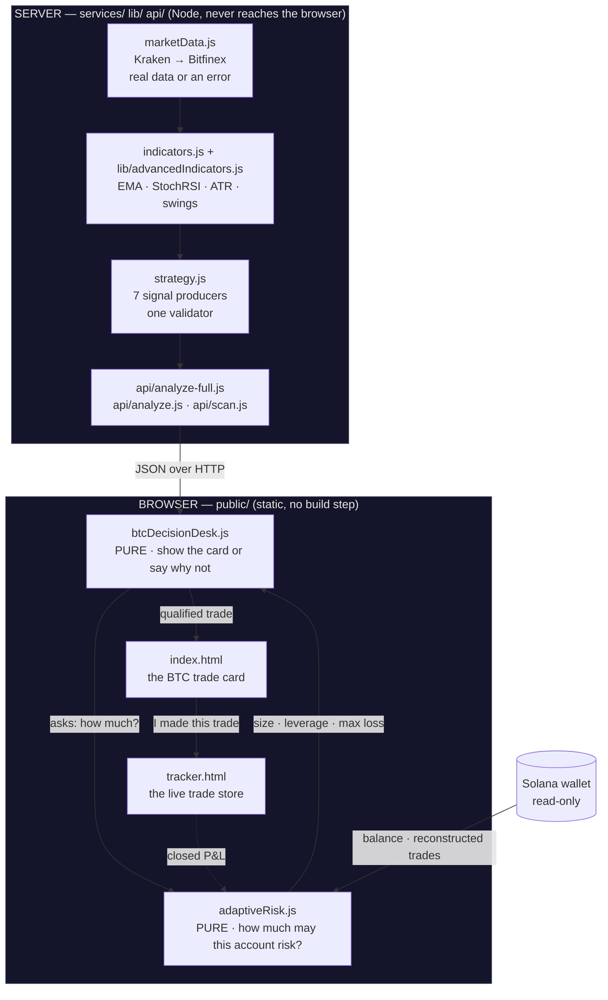
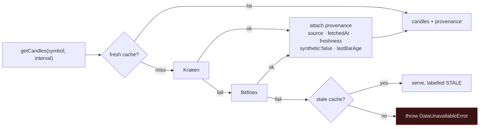
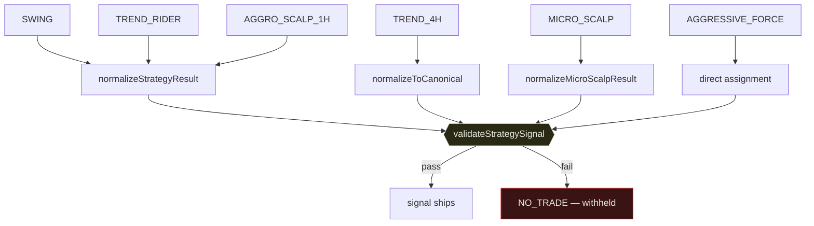
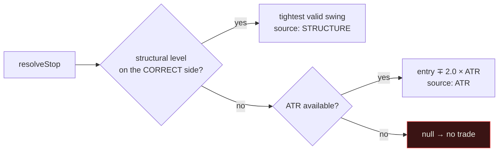
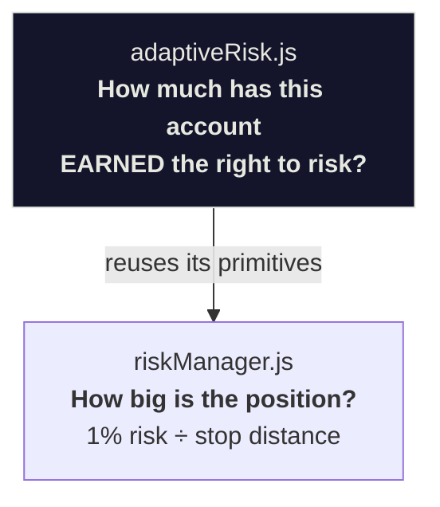
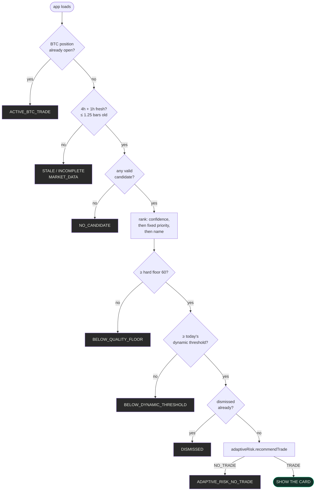
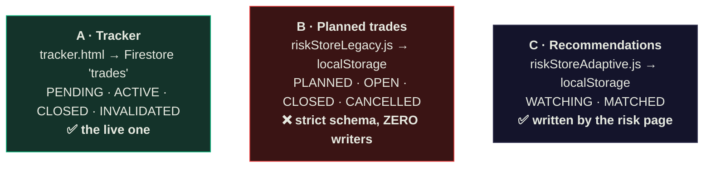
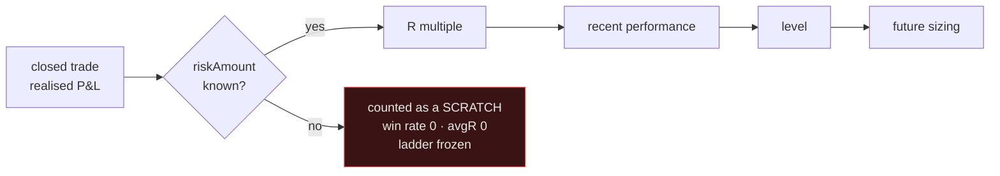

# EditTrades — architecture

Schematics of how the system actually works, as opposed to how the older design
docs say it works. Where this disagrees with another doc, trust the code and
this file; several `docs/` files predate large changes.

Diagrams are Mermaid and render on GitHub.

**Start with `CLAUDE.md`** for the landmines. This file is the map.

---

## 1. The one-paragraph version

A request for BTC produces multi-timeframe candles from a real exchange (or an
error — never a substitute). Indicators are computed per timeframe. A strategy
engine scores several independent setups and emits at most one tradeable signal
per strategy. In the browser, a decision desk picks one, checks it against a
quality floor, and asks an adaptive risk engine how much this particular account
has earned the right to risk. If everything passes, a card appears. The user
executes elsewhere and taps "I made this trade", which hands the record to the
tracker. Closed trades feed back into the account's level, which changes future
sizing.

---

## 2. Top-level flow



**The server/browser split is load-bearing.** `public/**` is served as static
files with no bundler, so a browser module physically cannot import from
`services/`. Anything needed on both sides is duplicated on purpose —
`services/riskManager.js` is a re-export shim whose entire header explains this.

---

## 3. Market data — real, or nothing



A synthetic-candle generator used to sit where `DataUnavailableError` now is —
it returned a `Math.random()` walk through the same code path as real candles.
It is gone, `assertNotSynthetic()` guards the return, and
`scripts/validate-market-data.js` asserts it cannot come back.

**Derived intervals.** `3m`, `3d`, `1M` and (on Bitfinex) `4h` are aggregated
from a finer series rather than fetched. The aggregator emits a **partial
trailing bucket** and records `sourceBars` so callers can drop it. Nothing reads
`sourceBars`.

**Provenance is a non-enumerable property on the candle array.** It survives the
internal `.slice()`, and is then **discarded on every production path**, because
the API layer keeps only `{indicators, structure, candleCount, lastCandle}` and
throws the array away. So the strategy engine cannot know how fresh its data is.
The decision desk re-derives freshness from `metadata.lastBarOpenTime` instead.

---

## 4. The per-timeframe object — get this shape right

Every API route builds the same structure, and getting it wrong is the single
most common source of silent bugs here:

```js
analysis['4h'] = {
  indicators: {                    // calculateAllIndicators()
    price:    { current, high, low },
    ema:      { ema21, ema200, ema21History, ema200History },
    stochRSI: { k, d, condition, history },
    analysis: { trend, pullbackState, distanceFrom21EMA },
    metadata: { candleCount, lastBarOpenTime, lastBarClosed }
  },
  structure: { swingHigh, swingLow },   // ← swings live HERE
  candleCount,
  lastCandle,
  volatility: { atr, atrPct, atrPercentile, volatilityState, timeframe },
  // ...plus levels / candle / priceAction / volume / confluence on some routes
};
```

> ⚠️ **`indicators.swingLow` does not exist.** Reading it yields `undefined`,
> and combined with `swingA || swingB || (entry * 0.97)` that made a hardcoded
> 3% stop unconditional on four strategies. Use `swingLevel(tf, side)`.

> ⚠️ **`volatility` is only present where `calculateAllAdvanced()` ran** —
> `api/analyze.js` and `api/indicators.js`. Other routes omit it, so ATR-based
> logic must degrade rather than assume.

---

## 5. Strategy engine

`services/strategy.js` is 4.4k lines and the least approachable part of the
system. Two entry points:

- **`evaluateStrategy(symbol, mtf, setupType, mode)`** — one setup type, returns
  a canonical `{symbol, price, htfBias, timeframes, signal, meta}`.
- **`evaluateAllStrategies(symbol, mtf, mode)`** — every strategy, returns a
  `strategies` map. **This is what the card uses.**

### Signal producers

There are **seven**, not the five the payload keys suggest:

| Producer | Status |
|---|---|
| SWING | live |
| TREND_4H | live |
| TREND_RIDER | live |
| SCALP_1H | crash fixed, but see below |
| MICRO_SCALP | **effectively dead** — reads several non-existent indicator paths, so its guard returns early. Deliberately left dead: switching on a strategy that has never executed, with no backtest, is not a safe side effect of a bug fix. |
| AGGRO_SCALP_1H | live, ships in the `SCALP_1H` slot |
| AGGRESSIVE_FORCE | live, synthesises a signal and overwrites the `TREND_4H` slot |

### Every producer now passes through one validator



`validateStrategySignal` previously had **one** caller, so four of the seven
producers were never geometry-checked. The observable consequence, on identical
data in a single response: TREND_4H was correctly rejected for
`stopLoss >= entryZone.min`, while TREND_RIDER shipped that same inverted
geometry as a valid LONG at 84% confidence and won `bestSignal`.

It checks: entry zone sane, stop on the correct side of the **near** edge,
**R > 0**, every target on the profitable side, and no target absurdly far from
entry.

### Stop resolution



The wrong-side filter matters: `detectSwingPoints` returns a **rolling 20-bar
extreme, not a confirmed pivot**, so a "swing low" can sit above the current
price. Used as a long's stop it produces a negative R and targets below entry.

---

## 6. Confidence

Weighted, then adjusted, then capped. **The rows sum to the score** — that is
enforced and tested.

```
              BASE (per strategy: SWING 80 … MICRO_SCALP 65)
                       │
        ┌──────────────┼──────────────┐
     × macro 0.40   × primary 0.35  × execution 0.25      ← a layer with NO DATA
        └──────────────┼──────────────┘                      contributes 0, not 1.0
                       │
              ± volume · flow · prediction markets
                       │
              clamp 0-100  →  contradiction caps
                       │
                    FINAL
```

| Evidence available | Score |
|---|---|
| Nothing (total blackout) | **0** |
| 4h + 1h only | **28** |
| All layers aligned | **81** |

Before the fix all three were **80** — absent layers defaulted to a `1.0`
multiplier, indistinguishable from perfect alignment, so a data blackout
produced a fully specified signal that cleared its own gate.

`calculateConfidenceWithHierarchy()` returns a `factors[]` array of named rows
with signed `points`. That is what the card's **WHY THIS TRADE** section renders.
A layer with no data shows as `0` with the reason *"contributes nothing"* rather
than as a negative penalty — "the trend disagreed" and "there was no data" must
not look alike to someone deciding whether to trade.

> **Honest limitation:** the number is *decomposable*, not *calibrated*. Every
> constant was picked, not fitted, and there is no reliability curve in the repo.
> Treat it as an ordering, not a probability. See `BTC_DECISION_DESK_STATUS.md` §4.2.

---

## 7. Risk — two layers



`adaptiveRisk.js` runs a strict decision hierarchy. **Hard constraints win, and
the gate is evaluated last:**

```
1. LEVEL              what the account has earned          (slow, −2 … 5)
2. STRATEGY           STANDARD or AGGRESSIVE preset
3. CONFIDENCE         moves risk INSIDE the envelope only
4. PERFORMANCE        recent results & drawdown — one-way DOWN
5. VOLATILITY         market regime — one-way DOWN
6. OPEN RISK          heat · exposure · concentration · margin
7. NO-TRADE GATE      overrules everything above
```

**Slow up, fast down.** Earning risk capacity takes many trades; losing it takes
one drawdown. Every haircut multiplies:

```
combined = performance × drawdown × returning × volatility     (each ≤ 1)
```

### The volatility haircut is downward-only, by construction

| ATR percentile | Factor |
|---|---|
| < 70th | **1.00** — a calm market earns nothing |
| ≥ 70th | 0.90 |
| ≥ 80th | 0.75 |
| ≥ 90th | 0.60 |
| unusable reading | 0.60 + warning |

There is deliberately no tier below the 70th, every factor is `< 1`, **and** the
result is clamped to `≤ 1` in code. Naive volatility targeting sizes *up* when
realised vol is low — which is precisely when a spike does most damage, and is
the February 2018 short-vol failure mode.

Absent volatility input is exactly neutral, so existing callers are byte-identical.

---

## 8. The BTC trade card



**Every refusal names a reason**, logged to the console. "Why is there no popup?"
is the hardest question to ask of a system like this, so the answer is always
available without a debugger.

**The quality floor cannot be negotiated down.** `ABSOLUTE_MIN_CONFIDENCE` is a
frozen constant, not a parameter and not mode-dependent. Volatility, drawdown and
degraded inputs can only **raise** the bar — there is no branch that subtracts.
AGGRESSIVE is *available* when the user allows it, never automatic, and still
requires the setup to be clear of the bar rather than scraping past it.

The card runs **in the browser** because `vercel.json` is at 12/12 functions.

---

## 9. Trade stores — there are three, and only one is live



**Extend store A. Do not revive B. Do not add a fourth.** Store A accepts extra
fields as-is (no whitelist on write), which is how the card attaches its
`recommendation` metadata block without a schema change. Stores B and C have
explicit field whitelists that silently drop anything unlisted.

The card hands off through the same `pendingTradeToTrack` localStorage door the
existing TRACK button uses — deliberately not a second trade tracker.

---

## 10. The feedback loop



The chain reconstructs trades from the Solana wallet, which supplies realised
P&L but has **no opinion on what you intended to risk**. Without `riskAmount`
every trade reads as a scratch and the level ladder cannot move.

The fix: the risk figure the engine sized was already stored on the
recommendation and is now written back onto the matched trade.

> ⚠️ **Still open for BTC.** Matching links a recommendation to an on-chain trade
> by asset, and there is no verified wrapped-BTC mint in this repo
> (`tokenMapping.js` carries its BTC/ETH entries with a literal `TODO: verify`).
> So on a BTC-only desk the loop does not yet close for BTC. The failure mode is
> safe — it stays `WATCHING`, never a false link. One verified address fixes it.

---

## 11. Validation

```
npm run validate:all
```

| Suite | Assertions | Covers |
|---|---|---|
| `validate:adaptive` | 275 | level ladder, envelopes, haircuts, fail-closed overrides |
| `validate:risk` | 114 | percent-risk maths, liquidation, cross-margin refusal |
| `validate:orchestrator` | 53 | card gates, floor, determinism, degenerate inputs |
| `validate:strategy-safety` | 32 | geometry, evidence coverage, stop resolution |
| `validate:volatility` | 31 | percentile regime, scale invariance |
| `validate:market-data` | — | no synthetic data, provenance, malformed rejection |
| `validate:decision-desk`, `validate:macro-core`, `validate:wallet` | — | |
| `validate:btc-value` | — | **network — SKIPPED in CI** |

All offline suites are deterministic: no clock, no randomness, no network.
Fixtures are hand-built.

**Browser QA** lives outside the repo (session scratchpad) and drives a real
Chromium at 320/375/390/430/768/1024 with programmatic assertions — overflow,
44px tap targets, rendered figures, Escape dismissal. It stubs
`/api/analyze-full`, so **the card has never been driven on live market data**.

---

## 12. Known-weak areas, ranked

1. **Confidence is uncalibrated.** The harness that would fix this now works but
   has no data — every exchange is 403 in CI.
2. **Candle finality.** Every provider returns the forming bar; nothing drops or
   flags it. ~11 signal families repaint intra-bar. Only `lib/levels.js` is honest
   about it.
3. **Provenance never reaches a decision.** Built, tested, and discarded by the
   API layer before the strategy engine sees it.
4. **`server.js` has a second, unprovenanced candle pipeline** (Binance →
   CoinGecko) that bypasses `marketData.js` entirely — no tripwire, no symbol guard.
5. **MICRO_SCALP and SCALP_1H** remain effectively non-functional, deliberately.
6. **PROTECT PROFIT is advisory only** — `tradeExecution.js` throws
   `Not Implemented`, and no stop is stored on a record after creation.
7. **ADD and REDUCE refuse on shorts.** The spot execution model cannot express
   them, and the previous behaviour was a swap in the opposite direction.

Full detail and a claim ledger: `docs/BTC_DECISION_DESK_STATUS.md`.
