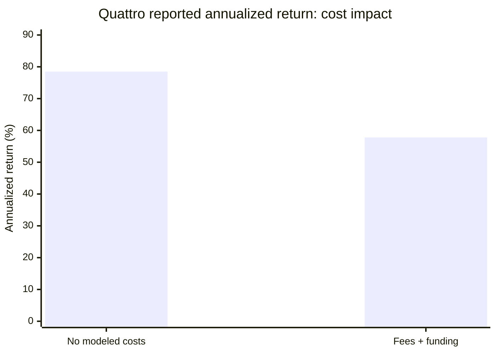
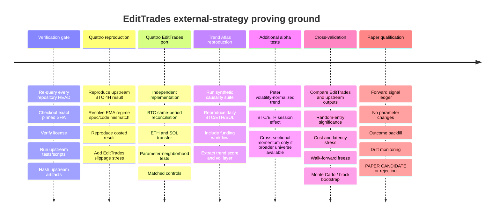

# EditTrades External Strategy Repository Research Report

## Executive summary

I screened the previously discussed repositories plus additional live GitHub candidates against a stricter standard than “has a backtest”: the repository needed an inspectable strategy specification, historical evidence, explicit or reconstructable costs, reproducibility artifacts, a usable license, and a plausible path into the existing EditTrades harness without replacing it.

The result is a **much narrower list than the earlier thread suggested**.

The most important conclusion is that there are **two repositories I would move directly into EditTrades’ proving ground**, three more worth reproducing as bounded experiments, and several attractive-looking repositories that should **not** be integrated yet.

**Highest priority:**

1. **`EstebanSP23/crypto_systematic_research` — Quattro Donchian**
   - Direct 4H BTC fit.
   - Long-only crypto trend/breakout.
   - Explicit entry, exit, ATR sizing, pyramiding, stops, next-open fills.
   - Costed version includes fees and historical funding.
   - MIT.
   - Biggest problem: **the prose specification and executable code disagree on the daily EMA200 regime definition.**
   - **Recommendation: PAPER CANDIDATE, contingent on reproducing both interpretations.** fileciteturn38file0L2-L2 fileciteturn40file0L2-L2

2. **`0xpg/crypto-trend-following` — Trend Atlas**
   - The strongest research-engineering package I found among the strategy repos.
   - Crypto perpetual trend following, explicit causal signals, BTC/ETH/SOL support, transaction costs, optional funding history, volatility targeting, no-trade buffer, correlation-aware risk, and dedicated future-tampering tests.
   - MIT.
   - Main issue: published experiment is daily rather than 4H and the convenient CCXT example omits funding.
   - **Recommendation: PAPER CANDIDATE as an external trend model; any 4H conversion must be treated as a new experiment.** fileciteturn35file0L2-L2

3. **`PeterLP123/systematic-crypto-research` — volatility-normalized trend**
   - Best evidence hygiene: frozen parameters, holdout, post-freeze monitoring, immutable snapshots, 59 deterministic tests, causal/cost audits, and preservation of failed variants.
   - Corrected 263-day post-selection trend result: **+9.54% net, 9.13% annualized, Sharpe 1.251, max drawdown -4.30%**; later frozen-forward segment: **+4.04%, Sharpe 1.289, max drawdown -3.74%**.
   - MIT.
   - Main problem for us: daily four-asset portfolio and MVO architecture are not a direct 4H BTC/ETH/SOL strategy.
   - **Recommendation: INCONCLUSIVE for direct port, but high priority for adapting its trend-score and risk concepts.** fileciteturn34file0L2-L2

The next tier is:

4. **`wzf01195010-png/Crypto-day-night-effects`** — highly reproducible, peer-reviewed, 1H/session-based BTC/ETH momentum/reversal research, but the reported search is broad and the cost grid is only 0–2 bps. **INCONCLUSIVE.** citeturn24view2turn22search4

5. **`matiasjarnal/crypto-momentum-strategy`** — clean cross-sectional momentum specification with 20 bps trading costs and 2023–2024 OOS Sharpe 1.12, but it depends on a 35-coin universe and is notebook-based with much weaker testing. **INCONCLUSIVE for EditTrades.** citeturn24view0

6. **`adensvaz/sentinel-hyperliquid` — Champion** — attractive Hyperliquid-native momentum/regime architecture, but the current config has diverged from the README/backtested formulation and contains an explicitly unbacktested intraday regime change. **INCONCLUSIVE until the exact frozen historical strategy is reconciled.** fileciteturn18file0L2-L2 fileciteturn36file0L2-L2

7. **`abailey81/Crypto-Statistical-Arbitrage`** — substantial MIT codebase with walk-forward artifacts and explicit costs, but the claimed BTC futures results—Sharpe **5.81**, 203.7% return, 0.89% drawdown, 95% win rate over 44,652 trades—are sufficiently extraordinary that I would **REJECT it for immediate integration pending an independent fill/leakage reproduction.** citeturn24view3

Critically, **I am not recommending that EditTrades import any of these codebases wholesale**. The useful path is:

> external rule specification → independent EditTrades implementation → same-data reproduction → same-cost reproduction → look-ahead tests → parameter-neighborhood tests → BTC/ETH/SOL transfer test → matched controls → paper candidate.

That keeps EditTrades as the system of record.

I also **screened out several repositories that looked compelling at first glance**. `0xrikt/crypto-skills`, Jesse, Freqtrade, NautilusTrader, CCXT, Hummingbot and FinRL-X are useful infrastructure/validation references, but they are not repositories demonstrating a specific alpha strategy that meets this request. `SainyTK/funding-arb-analysis` has unusually credible research backing but I did not find a permissive license in the repository. `Shri-Gopalakrishnan/Volatility_regime_backtest` reports spectacular SOL mean-reversion results but contains only a README and notebook, has no repository license, and the README does not document realistic trading costs; therefore it fails this screen despite its direct BTC/ETH/SOL/Hyperliquid fit. fileciteturn27file0L2-L2 fileciteturn28file0L2-L2

One operational caveat: I verified the repositories and pinned SHAs through the live GitHub API. I also attempted a shell-level `git ls-remote` from the execution environment, but outbound GitHub DNS is blocked in that runtime (`Could not resolve host: github.com`). Therefore **the SHAs are API-verified, but local clone/test reproduction has not yet been executed here**. The rollout gate at the end requires a second agent to independently recheck every SHA and actually run the repositories before any EditTrades implementation.

## Evaluation standard

I treated “historical evidence of edge” conservatively. It does **not** mean the strategy is proved to make money in the future. A backtest can survive costs and still be the product of selection bias, data snooping, favorable fill assumptions, survivorship bias, a single market regime, or an implementation defect.

The academic evidence does make the trend family a particularly reasonable place to investigate. Moskowitz, Ooi and Pedersen documented time-series momentum across 58 liquid futures instruments; Moreira and Muir documented the benefit of reducing exposure as realized volatility rises; and the more recent *Catching Crypto Trends* study applies trend-following methods specifically to Bitcoin and a broad cryptocurrency universe. Those papers support the **mechanism/family**, not the correctness of any individual GitHub backtest. citeturn22search0turn22search2turn22search1

Primary-source links requested:

- Time-Series Momentum: `https://doi.org/10.1016/j.jfineco.2011.11.003` citeturn22search0
- Volatility-Managed Portfolios: `https://doi.org/10.1111/jofi.12513` citeturn22search2
- Catching Crypto Trends: `https://papers.ssrn.com/sol3/papers.cfm?abstract_id=5209907` citeturn22search1
- Crypto day/night momentum/reversal study: `https://doi.org/10.3390/jrfm19090692` citeturn22search4

For this report, a repository had to score well on six dimensions:

| Gate | What I required |
|---|---|
| Strategy specification | Entry, exit and sizing can be expressed deterministically rather than inferred from marketing prose |
| Evidence | Backtest results/artifacts, ideally chronological OOS or walk-forward |
| Costs | Fees, slippage, spread, funding, or a clearly identified omission |
| Causality | Shifted indicators/next-event execution or evidence that future bars cannot contaminate decisions |
| Reproducibility | Scripts/tests/artifacts sufficient to challenge the reported result |
| EditTrades fit | The signal can be implemented as another strategy module without replacing the harness |

The recommendation labels therefore mean:

**PAPER CANDIDATE** means “worthy of immediate independent implementation and validation inside the EditTrades harness,” **not** “ready to trade.”

**INCONCLUSIVE** means the concept is worth investigating, but the public evidence or EditTrades mapping has an important unresolved issue.

**REJECT** means it should not consume implementation effort now. It may still contain useful research ideas.

## Top candidates

| Priority | Repository / family | Historical evidence | Cost realism | EditTrades fit | Reproducibility | Effort | Decision |
|---|---|---|---|---|---|---|---|
| **A** | `EstebanSP23/crypto_systematic_research` — 4H Donchian trend | Reported costed Quattro remains strongly profitable; 94-trade baseline | 0.06% taker fills + historical funding; **no slippage** | **Excellent:** 4H BTC/perp-style | Good scripts/results; specification mismatch must be reconciled | **Low–Medium** | **PAPER CANDIDATE** fileciteturn38file0L2-L2 |
| **A** | `0xpg/crypto-trend-following` — multi-speed TSMOM | +215.9%, CAGR 19.1%, Sharpe 1.03, maxDD -32.5% default experiment | 10 bps turnover cost; archive path supports funding; default run excludes it | Good assets/perps, but daily → 4H is adaptation | **Excellent:** causality/tampering tests | **Medium** | **PAPER CANDIDATE** fileciteturn35file0L2-L2 |
| **A−** | `PeterLP123/systematic-crypto-research` — vol-normalized trend | 263-day post-selection +9.54%, ann. +9.13%, Sharpe 1.251, maxDD -4.30% | Lagged Abdi–Ranaldo spread costs, audited/corrected | Good concept; daily four-asset implementation not direct | **Excellent:** 59 tests, freeze hashes, forward snapshots | **Medium** | **INCONCLUSIVE** fileciteturn34file0L2-L2 |
| **B** | `wzf01195010-png/Crypto-day-night-effects` — session momentum/reversal | Peer-reviewed BTC/ETH study; committed result tables/statistical tests | Only 0/1/2 bps scenarios; no perp funding/full EditTrades slippage | **Very good timeframe fit:** underlying 1H | Good scripts/artifacts; raw data must be sourced separately | **Low–Medium** | **INCONCLUSIVE** citeturn24view2turn22search4 |
| **B** | `matiasjarnal/crypto-momentum-strategy` — cross-sectional momentum | OOS ann. return 24.1%, Sharpe 1.12, maxDD -25.3% | 20 bps/trade = 7 bps commission + 13 bps slippage | BTC/ETH/SOL included, but needs 35-asset breadth | Notebook reproduction, no comparable deterministic test suite | **Medium–High** | **INCONCLUSIVE** citeturn24view0 |
| **B−** | `adensvaz/sentinel-hyperliquid` — Champion momentum/regime | README: balanced CAGR 39%, Sharpe 1.12, maxDD ~32%, 5.5y | Current execution config has maker/taker assumption + 5 bps slippage, but historical assumptions differ | Hyperliquid-native, but relies on broad coin universe | Tests/code exist; **current/backtested spec drift** | **Medium–High** | **INCONCLUSIVE** fileciteturn36file0L2-L2 |

The ranking intentionally favors **ease of falsification** as well as headline performance. A plain 4H Donchian model with 94 trades is far more valuable to EditTrades right now than an enormous ML/stat-arb stack claiming a Sharpe above 5, because we can faithfully implement and challenge the Donchian mechanism in the harness with relatively little new infrastructure.

### Reported cost sensitivity on the leading candidate

Quattro is useful precisely because its own cost study shows that implementation drag matters materially. The repository reports the historical result dropping from approximately **+1,107% to +610% total return**, with annualized return dropping from about **78.5% to 57.8%**, after its 0.06%-per-fill fee model and historical Binance-perp funding proxy are included. Slippage remains omitted, so EditTrades must stress that separately. fileciteturn6file0L2-L2



The right interpretation is **not** “57.8% is our expected return.” It is that the strategy still appeared historically material after a meaningful cost layer and is therefore worth independent falsification.

## Detailed shortlist

**`EstebanSP23/crypto_systematic_research` — Quattro Donchian**

Clone:

```text
https://github.com/EstebanSP23/crypto_systematic_research.git
```

Pinned HEAD observed September 27, 2026:

```text
5df0c43f6d48b7d8dbb74843d6747e5ddbb6819b
```

That commit was published September 24, 2026, and the repository carries an MIT license. fileciteturn40file0L2-L2 fileciteturn30file0L2-L2

**Family:** Donchian / trend / breakout.

**Executable rule at the pinned SHA:**

```text
TIMEFRAME = 4H
SIDE = LONG ONLY

donchian_entry = previous 20-bar high
donchian_exit  = previous 10-bar low
N              = ATR(14)

REGIME:
    closed_4h_close > lagged daily EMA200

ENTRY:
    if closed_4h_close > previous_20bar_high
       and regime == true:
           enter at next 4H open

INITIAL UNIT:
    dollar_risk = account_equity * 0.02
    stop_distance = 2 * N
    size = dollar_risk / stop_distance

PYRAMID:
    add unit at:
        entry + 0.5N
        entry + 1.0N
        entry + 1.5N
    max units = 4
    N remains fixed from original entry

TRAIL:
    common_stop = newest_unit_entry - 2N
    stop can tighten, never loosen

EXIT:
    if closed_4h_close < previous_10bar_low:
        exit all at next 4H open

CATASTROPHE EXIT:
    total campaign unrealized loss >= 5% of account
```

The source explicitly shifts both Donchian channels one bar and delays the daily EMA so that a daily value becomes available on the next day, which is good causal practice. Entry from a closing breakout is executed at the following 4H open. fileciteturn38file0L2-L2

**Important defect to resolve:** the executable code uses:

```text
4H close > daily EMA200
```

for its regime, while repository prose elsewhere describes the filter as a **rising daily EMA200**. Those are not equivalent strategies. The orchestrating agent must not silently pick one. Register both as:

```text
QUATTRO_CODE_REGIME
QUATTRO_DOC_REGIME
```

and establish which generated the published costed artifacts before evaluating either. fileciteturn38file0L2-L2

**Data:** BTC/USDT 4H plus daily candles; costed study uses perpetual funding history/proxy.

**Costs:** reported costed version charges 0.06% taker cost per fill and historical Binance BTC perpetual funding as a proxy; slippage is not modeled. That makes an EditTrades slippage stress mandatory. fileciteturn6file0L2-L2

**Reported evidence:** approximately 94 trades in the main baseline; no-cost historical total return approximately +1,107%, costed approximately +610%; reported costed APY approximately 57.8% and max drawdown roughly -41.7%. These are author results, not independently reproduced figures. fileciteturn6file0L2-L2

**Immediate integration:** **Low–Medium.** EditTrades already operates on the relevant type of OHLCV/timeframe logic. New work is mainly Donchian channels, fixed-entry ATR campaign state, pyramiding, and strict intrabar ordering.

**Blockers:** specification/code mismatch; wick-based exact stop fills can be optimistic on gaps; no slippage; funding venue proxy; pyramiding increases event-ordering complexity.

**Recommendation: `PAPER CANDIDATE`.** This is the first external strategy I would port.

**`0xpg/crypto-trend-following` — Trend Atlas**

Clone:

```text
https://github.com/0xpg/crypto-trend-following.git
```

Pinned SHA:

```text
4aaa229f5bc9f1b762ba4f6ba5d83c9f5cfef294
```

The current commit was dated August 2, 2026. The repository is MIT-licensed. fileciteturn14file0L2-L2 fileciteturn32file0L2-L2

**Family:** TSMOM / multi-speed trend / volatility-managed.

Its core is substantially more sophisticated than a moving-average crossover:

```text
For each asset, daily:

for (fast, slow) in [(16,48), (32,96), (64,192)]:
    raw = EWMA_fast(log_price) - EWMA_slow(log_price)

    normalized =
        raw /
        (daily_volatility * sqrt(slow))

    standardized =
        normalized /
        rolling_std(normalized, 365 days)

trend_score =
    mean(standardized across speeds)

trend_score = clip(trend_score, -6, +6)
trend_score = LAG ONE BAR

signal_strength = tanh(trend_score)

forecast_vol =
    blend short- and long-window realized volatility
    with 20% annual volatility floor

position =
    signal_strength / forecast_vol

portfolio:
    shrink correlations
    cluster correlated assets
    target 20% annual portfolio volatility
    max gross leverage 2x

trade only when:
    target change exceeds 10% no-trade buffer
```

The pinned code explicitly says the final trend score is shifted one day so row `t` depends only on closes through `t-1`; volatility sizing is also lagged. fileciteturn22file0L2-L2

The default public experiment uses 12 fixed Binance USD-M contracts from January 2020 through August 2026, 20% annualized volatility target, and **10 bps per traded notional**. It reports **+215.9% total return, 19.1% CAGR, net Sharpe 1.03, annualized volatility 18.7%, max drawdown -32.5%, and annual turnover 7.5×**. The repository explicitly warns that this default experiment excludes funding and uses a fixed universe. fileciteturn35file0L2-L2

A separate archive pipeline can include published funding history. Most importantly from a harness-quality perspective, the repo's unit tests cover signal timing, missing data, delisting behavior, costs, funding signs, volatility targeting, leverage, clustering and portfolio ruin; it also includes a future-input tampering test intended to prove that modifying future observations cannot alter earlier outputs. fileciteturn35file0L2-L2

**Data:** daily crypto perp OHLCV, volume, optional funding. The supplied CCXT script explicitly accepts BTC, ETH and SOL. fileciteturn35file0L2-L2

**Immediate integration:** **Medium.** We do not need its whole portfolio system. The highest-value pieces are the multi-speed volatility-normalized trend score, volatility sizing and no-trade buffer.

**Blockers:** original evidence is daily; changing `(16,48)/(32,96)/(64,192)` directly to 4H bars changes their economic horizons drastically. The original daily strategy should be reproduced first. Funding must be incorporated for a perp comparison.

**Recommendation: `PAPER CANDIDATE`.** Second external trend experiment after Quattro.

**`PeterLP123/systematic-crypto-research` — frozen volatility-normalized trend**

Clone:

```text
https://github.com/PeterLP123/systematic-crypto-research.git
```

Pinned SHA:

```text
a16b8c595fecbab40a25b7fdb30652c5bcda6b92
```

The observed HEAD was dated August 5, 2026. License is MIT. fileciteturn41file0L2-L2 fileciteturn31file0L2-L2

**Family:** moving-average trend / volatility normalized / portfolio risk allocation.

The frozen Strategy 1 implementation can be summarized as:

```text
assets = BTC, ETH, BNB, ADA
frequency = daily

MA = SMA(close, 140)
trend_raw = close / MA - 1

vol = std(daily_return, 30)

z = trend_raw / vol
z = clip(z, -5, +5)

active = abs(z) > 1.0

For active assets:
    expected-return proxy = z

covariance =
    Ledoit-Wolf covariance
    from previous 120 observations

solve:
    maximize μ'w - (gamma/2) w'Σw
    subject to sum(abs(w)) <= 1
    gamma = 1

rebalance every 10 days
```

The code also has a deterministic equal-signed fallback if covariance history is insufficient. fileciteturn10file0L2-L2

Transaction costs use lagged Abdi–Ranaldo spread estimates from OHLC data rather than a convenient flat zero. The project subsequently discovered that its original spread implementation used an unsupported absolute-value correction; the repository corrected the estimator **without retuning the strategy**, preserved the old numbers for provenance, and published the corrected continuous result. That sort of self-audit materially increases my confidence in the research process. fileciteturn34file0L2-L2

Corrected 263-day continuous post-selection results:

```text
Net return             +9.54%
Annualized return      +9.13%
Sharpe                  1.251
Max drawdown           -4.30%
Gross P&L              +4,563 USDT
Transaction costs         -98 USDT
Net P&L                +4,465 USDT
```

The later 137-day frozen-forward segment reports **+4.04% return, Sharpe 1.289 and max drawdown -3.74%**. Importantly, the parameters are hash-frozen and later data cannot trigger retuning. fileciteturn34file0L2-L2

The repo has **59 deterministic tests**, CI, immutable dated evidence snapshots, incomplete-candle rejection, cutoff-boundary tests and hash verification of strategy specifications. fileciteturn34file0L2-L2

**Immediate integration:** **Medium.** I would not import MVO first. The immediate EditTrades experiments should be:

```text
trend_raw = price / SMA - 1
trend_strength = trend_raw / realized_volatility
```

followed by a bounded test of the dead-zone concept:

```text
no directional opinion if |trend_strength| <= threshold
```

This potentially gives your signal engine a **continuous trend-strength measurement** rather than another yes/no EMA condition.

**Blockers:** daily frequency, four-asset allocation, very heavy BTC concentration during the evaluated period, and no complete perp-funding treatment. Porting it to 4H BTC/ETH/SOL is a new strategy hypothesis.

**Recommendation: `INCONCLUSIVE` as a direct strategy; high-value model component.**

**`wzf01195010-png/Crypto-day-night-effects` — lagged session momentum/reversal**

Clone:

```text
https://github.com/wzf01195010-png/Crypto-day-night-effects.git
```

Pinned SHA:

```text
5693993e108f2b3668bd21b1dd36ae31f79d8fcd
```

The commit was dated August 19, 2026, and added replication artifacts. The repo is MIT-licensed. fileciteturn24file0L2-L2 citeturn24view2

**Family:** intraday/session momentum and mean reversion.

This is unusual on our list because it accompanies a 2026 peer-reviewed article rather than simply a self-published strategy README. The study uses hourly Kraken BTC and ETH history from 2016–2025, divides the day into complementary 12-hour sessions, and evaluates ordered combinations of five session behaviors: cash, long, short, lagged momentum and lagged reversal. The paper's selected full-sample rules are BTC **Reversal/Reversal** around the 08:00–20:00 UTC split and ETH **Long/Reversal** around a 05:00–17:00 UTC split. citeturn22search4turn22search10

At each session boundary, conceptually:

```text
rule ∈ {
    CASH,
    ALWAYS_LONG,
    ALWAYS_SHORT,
    sign(lagged_session_return),      # momentum
    -sign(lagged_session_return)      # reversal
}

apply separate rule to each of the two 12h sessions
```

The exact lag/session indexing must be ported from `btc_eth_backtest.py`, not reconstructed from my shorthand above.

The GitHub repo is unusually good about artifacts: it includes scripts for the complete strategy search, statistical tests, annual Sharpe/max-drawdown figures and machine-readable result tables. The two major committed tables contain **1,050** and **1,800** rows respectively, covering BTC/ETH, 25 ordered strategy combinations, multiple UTC boundaries and 0/1/2 bps transaction-cost assumptions. citeturn24view2

However, the raw Kraken files are deliberately **not** redistributed; the authors explicitly require researchers to independently verify provenance rather than relabel third-party historical data. citeturn24view2

The major concern is multiple testing. The paper examines 25 rule combinations across 12 hourly cutoffs; that is exactly the kind of search in which a visually superior historical cutoff can emerge by chance. Therefore the EditTrades experiment should freeze the paper's preferred rule first and evaluate it on later/unseen data—not rerun all cutoffs and choose our favorite. citeturn24view2turn22search4

**Costs:** 0, 1 and 2 bps scenarios. That is too light for an EditTrades perpetual strategy once realistic fees/slippage/funding are included.

**Reported metrics:** the repository commits annualized Sharpe and maximum-drawdown tables rather than presenting one clean universal CAGR/Sharpe/maxDD headline in its README. I am deliberately not substituting a cherry-picked row here. Those tables should be regenerated and the preregistered paper-preferred BTC/ETH rows extracted during reproduction. citeturn24view2

**Immediate integration:** **Low–Medium.** The underlying data are 1H and the rule is simple. This is much closer to the timeframes EditTrades already watches than a daily portfolio optimizer.

**Blockers:** data sourcing, low cost assumptions, selection multiplicity, no SOL result.

**Recommendation: `INCONCLUSIVE`, but a worthwhile small experiment.**

**`matiasjarnal/crypto-momentum-strategy` — cross-sectional momentum**

Clone:

```text
https://github.com/matiasjarnal/crypto-momentum-strategy.git
```

Pinned SHA:

```text
38a216a5dddf7b35908478273e4d6216bea712ab
```

Current commit observed July 5, 2026. License is MIT. fileciteturn23file0L2-L2 fileciteturn33file0L2-L2

**Family:** cross-sectional momentum + BTC regime + volatility targeting.

Core rule:

```text
UNIVERSE:
    35 liquid cryptos
    60d median ADV >= $5M
    >=365d history

SIGNAL:
    compound returns over 10d / 20d / 60d
    cross-sectional z-score
    winsorize ±3σ

ENSEMBLE:
    choose top 3 specifications on training sample
    equal-combine them OOS

BULL REGIME:
    BTC > BTC SMA200
    gross = 1.0x
    normal momentum tilt

BEAR REGIME:
    BTC < BTC SMA200
    gross = 0.5x
    tilt toward low volatility
    reduce top-K by 30%

WEIGHTS:
    softmax signal weighting
    30d inverse-volatility adjustment
    exponentially smooth weights, α = 0.25

PORTFOLIO:
    target 20% annual volatility
    max leverage = 3x
```

The repo uses **20 bps per trade**, explicitly decomposed as 7 bps commission plus 13 bps slippage. Training is 2018–2022 and testing 2023–2024, with separate walk-forward evaluation across the two OOS years. citeturn24view0

Reported 2023–2024 OOS:

```text
Annualized return        24.1%
Annualized volatility    21.5%
Sharpe                    1.12
Maximum drawdown        -25.3%
BTC beta                 ~0.32
Average turnover          ~5.8% / rebalance
```

The repo reports an alpha t-stat around 2.6, although that result should be independently checked given the in-sample search used to select the three ensemble configurations. citeturn24view0

**Reproducibility:** lower than our first three candidates. The workflow is one large Jupyter notebook that downloads market data rather than a test-heavy strategy package. citeturn24view0

**Immediate integration:** **Medium–High.** The critical limitation is not coding complexity; it is that the alpha is explicitly **cross-sectional**. Reducing 35 assets to BTC/ETH/SOL fundamentally changes the information available to the ranking signal.

A useful EditTrades adaptation might eventually be:

```text
BTC regime
+
relative strength of BTC / ETH / SOL
+
volatility-scaled confidence
```

but we must call that an **adaptation**, not a reproduction.

**Recommendation: `INCONCLUSIVE`.**

**`adensvaz/sentinel-hyperliquid` — Champion**

Clone:

```text
https://github.com/adensvaz/sentinel-hyperliquid.git
```

Pinned SHA:

```text
ca647c099755ae9770f92205d5fc413e8e7c6c95
```

The observed commit is dated September 21, 2026; the repo is MIT-licensed. fileciteturn16file0L2-L2 fileciteturn17file0L2-L2

**Family:** cross-sectional momentum / BTC regime / volatility-managed exposure.

The current Champion config says:

```text
universe = top 24 liquid Hyperliquid assets
minimum listing age = 90 days

rank assets on 30-day momentum
hold top 5
long only

BTC regime:
    if BTC > SMA100:
        risk on
    else:
        cash

momentum_weighted = true
max name weight = 40%
target gross = 1x

risk overlay:
    realized-volatility target
    21-day vol lookback
    drawdown throttle from 12% to 35%
    minimum risk scale 25%
```

Current paper-execution assumptions include 50% assumed maker fill probability with unfilled maker attempts effectively chasing as taker, plus 5 bps slippage. fileciteturn18file0L2-L2

The historical README reports for Champion:

```text
CAGR                 ~39% balanced / ~69% raw
Sharpe                1.12
Max drawdown         ~32%
Worst-half Sharpe     0.75
Time in cash         ~45%
History               5.5 years
```

fileciteturn36file0L2-L2

The red flag is **strategy drift**.

The README diagram describes a 50-day per-name trend confirmation, but the current Champion config explicitly has:

```text
dual_confirm: false
```

because later research says disabling it improved results. More importantly:

```text
intraday_regime_check: true
```

is explicitly annotated in the config as **not backtested**, because Hyperliquid's available hourly history produced too few regime-flip events to evaluate it. fileciteturn18file0L2-L2

That means the current serving specification is not identical to the historically validated specification.

This is precisely the sort of train/backtest → serve mismatch we need our own harness to prevent.

The repo is nonetheless interesting because it documents these changes unusually candidly. Its funding-carry config, for example, records that the old live signal had **203 closed trades, profit factor 0.975 and -$0.56 expectancy/trade**, and explicitly backs off position sizing while new evidence accumulates. It also acknowledges that a seven-lookback selection did not survive a strict 5% multiple-testing correction. fileciteturn19file0L2-L2

**Immediate integration:** **Medium–High** because its cross-sectional strategy expects 24 assets rather than our BTC/ETH/SOL focus.

**What is immediately useful:** BTC regime brake, momentum-strength sizing, drawdown/volatility overlay, and the discipline of logging strategy-version changes.

**Recommendation: `INCONCLUSIVE` until a frozen Champion specification is reconstructed and reproduced.**

**`abailey81/Crypto-Statistical-Arbitrage` — stat-arb / funding/basis**

Clone:

```text
https://github.com/abailey81/Crypto-Statistical-Arbitrage.git
```

Pinned SHA:

```text
44b718e4a4ef875ea12dfda30370ab1cc8b54a26
```

Observed HEAD is March 15, 2026; repository is MIT-licensed. fileciteturn25file0L2-L2 citeturn24view3

For the more straightforward stat-arb component:

```text
find cointegrated pairs

CEX entry:
    abs(zscore) >= 2.0

exit:
    spread returns to mean

stop:
    abs(zscore) >= 3.0

max pair notional:
    $100,000

max concurrent positions:
    5 to 8

position sizing:
    fractional Kelly 0.25–0.50
    total leverage = 1x

CEX estimated four-leg round-trip cost:
    0.20%
```

Its BTC futures subsystem combines funding-rate carry, calendar spreads and cross-venue basis with hourly rebalancing. citeturn24view3

Reported walk-forward test, July 2023–December 2024:

```text
Altcoin stat-arb:
Sharpe            1.61
Total return      6.84%
MaxDD             4.64%
Trades            127
Profit factor     1.69

BTC futures:
Sharpe            5.81
Total return    203.70%
MaxDD             0.89%
Trades           44,652
Win rate          95.02%
Profit factor     28.53
```

The repo says these are no-leverage results with transaction costs included. citeturn24view3

Those BTC-futures numbers are **not automatically a positive sign**. A 5.81 Sharpe, 95% win rate, 0.89% maximum drawdown and 28.53 profit factor over 44,652 trades is so strong that the first research task must be trying to break it.

The codebase is also enormous relative to what EditTrades needs: the README describes 184 Python files, 137 dependencies, 32 venues, ML enhancements, multiple data providers, event-driven and vectorized backtesters, and 61 validation checks. citeturn24view3

**Immediate integration:** **High.**

**Mandatory audits:** timestamp alignment of funding, mark versus fill prices, bid/ask assumptions, futures-calendar roll construction, cross-venue availability at signal time, market-impact model, ML feature/label splitting and any fallback/synthetic data path.

**Recommendation: `REJECT` for immediate EditTrades implementation.** Keep it in the proving ground as a strategy source only. It gets reconsidered only if a clean, minimal subsystem reproduces independently.

## Repositories screened out and why

Several repositories from the thread are **useful but should not be confused with alpha candidates**.

**Jesse, Freqtrade and NautilusTrader** remain valuable to our harness as *independent validators*: Jesse for significance/random-entry and Monte Carlo-style challenge tests; Freqtrade for look-ahead/recursive-bias checks; NautilusTrader for a later event-driven fill simulation of finalists. They do not enter this shortlist because they are trading/research frameworks rather than repositories providing the particular documented historical strategy edge requested here.

**CCXT** remains useful as a normalized market-data/exchange adapter. **Hummingbot** is useful if EditTrades later develops market-making, funding/carry or cross-venue execution. **FinRL-X** is useful for architecture research. None should be installed simply to “give EditTrades edge”; they provide infrastructure, not alpha.

**`0xrikt/crypto-skills`** is similarly a useful backtest reference for simple SMA and indicator rules, but I found no reason to treat the repository itself as evidence that a specific strategy has a demonstrated cost-adjusted edge. It should remain a validation/reference tool rather than a strategy candidate.

**`Shri-Gopalakrishnan/Volatility_regime_backtest`** is extremely tempting because it directly tests BTC/ETH/SOL on Hyperliquid and reports BTC baseline Sharpe **3.24** and SOL Sharpe **7.35**, with a Hurst-filtered SOL variant reporting Sharpe **11.74**. Its rule is clean:

```text
24h realized-vol z-score > 1.5
AND abs(4h move) > ~1%

→ fade the 4h move

exit when:
vol z-score < 0.5
OR 24 hours pass
OR 15% stop
```

But the sample is only six months, the Hurst-filtered SOL result has only **12 trades**, the root contains only a README and notebook, **there is no LICENSE file**, and the README does not specify realistic fees/slippage/funding. It therefore fails two of the user's hard gates despite being a good hypothesis to potentially recreate independently. fileciteturn27file0L2-L2 fileciteturn28file0L2-L2

**`SainyTK/funding-arb-analysis`** is scientifically interesting because it is associated with published funding-arbitrage research and was still live at SHA `62899f887d197f170244e8116312951132429407` in July 2026, but the repository root I inspected did not expose a license. I therefore did not promote it into a code-adaptation shortlist. fileciteturn12file0L2-L2 fileciteturn13file0L2-L2

The underlying paper remains a useful conceptual source:

```text
https://doi.org/10.1016/j.bcra.2025.100354
```

**`AKzar1el/walk-forward-crypto`** also looked promising in search because it documents 4H crypto walk-forward work, but the pinned repository root consists of README/docs/license rather than an implementation source tree. That fails the “clone and reproduce the strategy implementation” requirement. fileciteturn20file0L2-L2

**`rubetron/Pairs_trading`** should remain an academic/methodological reference for classical pairs trading rather than an immediate EditTrades strategy. Its underlying problem domain is equities and an adaptation to BTC/ETH/SOL would be a new crypto hypothesis rather than a reproduction.

This is important for the proving ground: **a repo does not qualify merely because it says “Sharpe,” “walk-forward,” or “AI.”** We should prefer the repository whose result is less spectacular but whose failure modes we can actually audit.

## Recommended rollout and independent reproduction gate

The sequence I would give the orchestrator is intentionally conservative.



The first implementation wave should therefore contain **only two alpha families**:

```text
EXTERNAL_QUATTRO_DONCHIAN_V1

and

EXTERNAL_TREND_ATLAS_V1
```

Peter's volatility-normalized score should initially be implemented as an **experimental feature/model output**, not immediately as another full portfolio strategy:

```text
trend_strength =
    (price / moving_average - 1)
    / realized_volatility
```

That value can later be tested as an independent advisor signal against your existing higher-timeframe bias.

The day/night model should be the first genuinely different short-horizon family:

```text
EXTERNAL_SESSION_EFFECT_V1
```

because it asks a different question from your current signal engine:

> Does the same price move have different conditional behavior depending on UTC session and the immediately preceding session?

That is more useful scientifically than creating five slight variations of Donchian.

### Mandatory second-agent verification

**Nothing in this report should be considered implementation-approved until another agent independently double-checks it.** The handoff agent should be instructed to challenge, not confirm, these findings.

At minimum, for every shortlisted repository it must:

```text
1. Query the repository again immediately before work.
2. Record:
   - clone URL
   - default branch
   - HEAD SHA
   - checkout SHA
   - license
   - dirty-tree status

3. Checkout the exact SHA listed here.

4. Compare:
   README rule
   paper rule
   config rule
   executable rule
   test rule

5. Report every mismatch.

6. Search specifically for:
   shift(-1)
   shift(+1)
   future indexing
   forward returns
   centered rolling windows
   bfill/backfill
   full-sample normalization
   full-sample universe selection
   labels crossing train/test boundaries
   contemporaneous higher-timeframe data
   unfinished candles

7. Verify:
   signal timestamp
   information-availability timestamp
   order timestamp
   modeled fill timestamp

8. Run the upstream tests.

9. Run a minimal upstream reproduction.

10. Change all future observations after a cutoff and verify
    that every pre-cutoff signal/P&L value remains unchanged.

11. Remove costs and then re-add each cost individually:
    fee
    spread
    slippage
    funding
    borrow/carry
    market impact where applicable.

12. Reproduce a few individual trades manually from candles.

13. Only then write the EditTrades version.

14. Never copy the upstream historical result into our evidence table
    as though EditTrades reproduced it.
```

The top three upstream smoke commands should begin approximately as follows:

```bash
# Quattro
git clone https://github.com/EstebanSP23/crypto_systematic_research.git
cd crypto_systematic_research
git checkout 5df0c43f6d48b7d8dbb74843d6747e5ddbb6819b
git status --short
```

Then inspect and run the exact Quattro scripts at that checkout rather than assuming the current README command still matches the pinned artifact. The first comparison must determine whether the published result used `price > daily EMA200` or `EMA200 rising`. fileciteturn38file0L2-L2

```bash
# Trend Atlas
git clone https://github.com/0xpg/crypto-trend-following.git
cd crypto-trend-following
git checkout 4aaa229f5bc9f1b762ba4f6ba5d83c9f5cfef294

python -m pip install -r requirements.txt
python -m unittest discover -s tests -v

python scripts/ccxt_backtest.py \
  --start 2022-01-01 \
  --symbols BTC/USDT:USDT ETH/USDT:USDT SOL/USDT:USDT
```

Those commands correspond directly to the repository's documented test and BTC/ETH/SOL CCXT path. fileciteturn35file0L2-L2

```bash
# PeterLP frozen research
git clone https://github.com/PeterLP123/systematic-crypto-research.git
cd systematic-crypto-research
git checkout a16b8c595fecbab40a25b7fdb30652c5bcda6b92

python3.12 -m venv .venv
source .venv/bin/activate
python -m pip install -r requirements-dev.txt
python -m pytest -q
```

Only after the offline tests pass should the agent attempt the data-refresh/frozen-forward commands. fileciteturn34file0L2-L2

For EditTrades, the reproduction contract should require a reconciliation table like this before a candidate advances:

| Check | Upstream | EditTrades | Allowed difference |
|---|---:|---:|---|
| Eligible dates | X | X | None |
| Input candles | X | X | None after normalization |
| Entry count | X | X | 0 |
| Exit count | X | X | 0 |
| Entry timestamps | X | X | 0 |
| Exit timestamps | X | X | 0 |
| Gross P&L | X | X | rounding only |
| Fees | X | X | documented model differences only |
| Funding | X | X | documented venue differences only |
| Net P&L | X | X | explainable from cost model |
| MaxDD | X | X | rounding only |
| Look-ahead tamper test | PASS | PASS | None |

After reconciliation, **we deliberately stop trying to match upstream economics** and switch to EditTrades assumptions:

```text
EditTrades data
EditTrades causal fills
EditTrades fees
EditTrades slippage
EditTrades funding
EditTrades BTC / ETH / SOL universe
EditTrades portfolio risk limits
```

A candidate should only survive as `PAPER CANDIDATE` if it still exhibits a **stable region of positive cost-adjusted expectancy**, rather than one magic parameter.

For Quattro specifically, do not merely test `20/10`. Test a preregistered neighborhood such as:

```text
Entry Donchian: 15 / 20 / 25 / 30
Exit Donchian:   7 / 10 / 12 / 15
```

without picking the historical winner afterward. The purpose is to see whether breakout persistence is a phenomenon or whether `20/10` is an isolated fitted coordinate.

For Trend Atlas, test **the published daily system first**, and only then preregister a 4H adaptation. Do not convert a 16-day EMA into 16 four-hour candles and call it the same model. Economic horizons should be preserved deliberately.

For Peter's model, test the *idea* in layers:

```text
A:
raw MA trend only

B:
raw MA trend / realized volatility

C:
B + dead zone

D:
C + volatility sizing
```

That will tell us whether the useful contribution is the moving average itself, volatility normalization, suppressing weak signals, or portfolio sizing.

Finally, these external strategies should not replace the EditTrades setup engine. The most valuable possible outcome is likely a set of **independent advisor signals**:

```text
EditTrades setup engine
    ↓
setup probability

Quattro
    ↓
breakout-trend state

Trend Atlas
    ↓
continuous trend forecast

Peter-style normalization
    ↓
trend strength / noise ratio

Session model
    ↓
intraday conditional bias

volatility layer
    ↓
risk / size modifier
```

The harness can then ask the question that actually matters:

> **When our existing EditTrades signal and a genuinely independent externally validated model agree, does forward expectancy improve enough to justify fewer but more accurate trades?**

That is a more promising route to improving trade-signal accuracy than replacing your existing system with somebody else's GitHub bot.